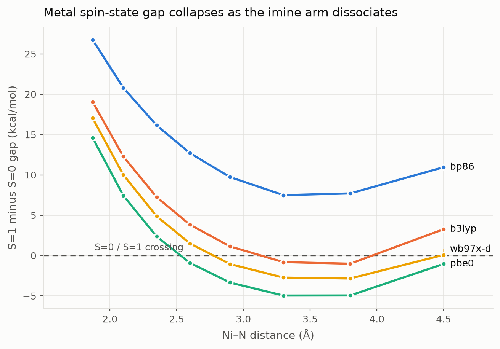

# NiMROD

**Ni**ckel **M**etal-organic **R**eporter **O**f **D**egradation.

Ab initio simulation of a spin-manifold **organic colour centre** used as a
nanosensor for the degradation of a metal-organic catalyst, built on
[Psi4](https://psicode.org) in the
[psi4numpy](https://github.com/FoleyLab/psi4numpy) idiom.

---

## The idea in one paragraph

Square-planar Ni(II) in a salen-type N₂O₂ pocket is d⁸ and closed-shell
(S = 0). When the catalyst starts to degrade, the first step is decoordination
of one imine arm: the ligand field weakens, and past some Ni–N separation the
**S = 1 state drops below S = 0** and the metal turns paramagnetic. To read that
out we attach an **organic colour centre** — a single aryl group covalently
bonded to a pyrene carbon, converting it to sp³. That one defect does two jobs
at once: it breaks the local π conjugation, creating a localised optical
transition, and it leaves an odd number of π electrons, creating an **unpaired
spin (S = 1/2)**. So the same defect reports through two independent channels —
an optical shift and a magnetic exchange coupling to the metal.

```
     pyrene host                phenylene tether        Ni(II) N2O2 catalyst
   ┌──────────────┐                                    ┌──────────────────┐
   │   ●─●─●─●    │                                    │      O     N     │
   │  ╱ ╲ ╱ ╲ ╱   │──── C6H4 ────────────────────────  │       ╲   ╱      │
   │ ●   C*  ●    │                                    │        Ni        │
   │  ╲ ╱│╲ ╱     │                                    │       ╱   ╲      │
   │   ●─┼─●      │                                    │      N     O     │
   └─────┼────────┘                                    └────────┼─────────┘
        aryl                                              labile arm, elongates
     sp3 defect                                            1.87 → 4.5 Å
   S = 1/2 + colour centre                            S = 0 → S = 1 on ligand loss
```

Full physical reasoning, method choices and limitations: **[docs/THEORY.md](docs/THEORY.md)**.

---

## Model system

| Object | Formula | Atoms | State |
|---|---|---|---|
| Host PAH | C₁₆H₁₀ (pyrene) | 26 | closed shell |
| Colour centre | C₂₂H₁₅ | 37 | **doublet** — sp³ aryl defect |
| Catalyst | C₆H₈N₂NiO₂ | 19 | singlet — square-planar d⁸ |
| Assembly | C₂₈H₂₁N₂NiO₂ | 54 | doublet |

The catalyst is a deliberately truncated salen analogue,
bis(iminoenolato)nickel(II). It keeps the electronic core that matters — a d⁸
metal in a square-planar N₂O₂ field — while being small enough for CASSCF, and
unlike real salen its chelate arms can dissociate completely, which a clean
ligand-loss coordinate requires.

PAHs are generated on an ideal graphene honeycomb lattice, so the builder is
checkable against known chemistry rather than against its own previous output;
the test suite asserts the molecular formulas of six PAHs, the sp³ character of
the defect carbon, and the *trans* donor geometry and bite angle of the complex.

---

## Results

### The spin manifold does flip

The load-bearing question was whether there is anything for a spin sensor to
detect. There is. As the imine arm swings open, the metal's S = 1 − S = 0 gap
collapses from ~+19 kcal/mol and three of four functionals cross into an S = 1
ground state.



| Ni–N (Å) | 1.87 | 2.35 | 2.90 | 3.30 | 3.80 | 4.50 |
|---|---|---|---|---|---|---|
| BP86 | +26.75 | +16.14 | +9.73 | +7.49 | +7.70 | +10.95 |
| B3LYP | +19.06 | +7.24 | +1.13 | −0.81 | −1.01 | +3.26 |
| PBE0 | +14.60 | +2.36 | −3.35 | −4.96 | −4.95 | −1.04 |
| ωB97X-D | +17.04 | +4.88 | −1.05 | −2.73 | −2.84 | +0.08 |
| **mean** | **+19.36** | **+7.66** | **+1.61** | **−0.25** | **−0.27** | **+3.31** |

Crossings: PBE0 at 2.53 Å, ωB97X-D at 2.78 Å, B3LYP at 3.13 Å. BP86 never
crosses — expected for a pure GGA with no exact exchange, which over-stabilises
low spin. **The crossing is real; its position is uncertain to roughly half an
ångström**, and that spread is the honest error bar.

The gap turning back up beyond ~3.8 Å is a feature of the rigid coordinate, not
of the chemistry: once the arm is fully detached the frozen remainder can no
longer reorganise into the three-coordinate geometry that stabilises S = 1.

### The colour centre is spin-localised, and feels the metal

On the A100, the full 54-atom assembly (584 basis functions) converges in 64
seconds. At the intact geometry the unpaired electron is **entirely** on the
colour centre — Mulliken spin 4×10⁻⁵ on nickel against 0.28–0.30 on the pyrene
carbons, 0.9995 of the total on the defect fragment. That is the sensor at rest:
closed-shell metal, S = 1/2 defect, no coupling.

By Ni–N = 4.50 Å the metal carries 0.064 and ⟨S²⟩ has risen from 0.814 to
**1.332**, far above the 0.75 of a clean doublet. That growth in quartet
character is the magnetic readout — the doublet is being forced to accommodate a
metal that has gone paramagnetic.

### Validation

22 of 24 benchmark gaps converge, none with the ground-state ordering wrong and
every triplet reference within 0.05 of ⟨S²⟩ = 2. Mean absolute error against the
single-determinant reference: **M06 2.77**, B3LYP 4.56, ωB97X-D 4.84, BP86 5.45,
PBE 6.94, TPSS 8.81, TPSSh 9.12, PBE0 9.16 kcal/mol.

Note that TPSSh — the conventional recommendation for 3d spin-state energetics,
and this project's original `REFERENCE_FUNCTIONAL` — comes out second worst. The
scan geometries use B3LYP on the strength of the measurement rather than the
reputation.

### What is *not* established

- **No optical readout yet.** TD-DFT ran on the assembly but on the unrelaxed
  builder geometry, and returned implausibly low excitation energies
  (0.09–2.0 eV) with oscillator strengths that failed to compute. Those numbers
  are in `data/results/assembly_gpu.jsonl` for provenance and **should not be
  quoted**. The optical channel needs a relaxed geometry first.
- **No exchange coupling J yet.** The broken-symmetry machinery is implemented
  and unit-tested but has not been run on the assembly.
- The scan is rigid, so crossing distances carry a systematic error, and there
  are no barriers or dissociation energies here.

## Install

Psi4 is not on PyPI — it ships through conda-forge. `setup.sh` fetches a
standalone micromamba (no root, no pre-existing conda) and builds the
environment:

```bash
./setup.sh
export MAMBA_ROOT_PREFIX="$PWD/.mamba"
./bin/micromamba run -n nimrod python -m nimrod.cli info
```

## Use

```bash
nimrod info                  # describe the model system
nimrod xyz sensor -o s.xyz   # dump a structure for viewing
nimrod validate              # spin-state validation against experiment
nimrod scan                  # catalyst degradation scan
nimrod occ                   # colour-centre photophysics
nimrod figures               # rebuild figures from stored results
```

Every calculation is cached in `data/cache/`, keyed by a hash of the full job
specification, so an interrupted run resumes instead of restarting.

---

## What is actually in here

```
nimrod/
  config.py       compute budget, basis + functional registries, SCF preset ladder
  psi4_driver.py  defensive Psi4 wrapper: option hygiene, SCF fallbacks, caching
  geometry.py     honeycomb PAH builder, sp3 defect, Ni complex, assembly, scan geometries
  spin.py         <S^2> from AO overlap, spin populations, broken symmetry, Yamaguchi J
  excited.py      TD-DFT and EOM-CCSD, colour-centre absorption and shift
  casscf.py       CASSCF spin manifolds and multireference diagnostics
  sapt.py         SAPT0 decomposition of solvent capture at the vacated site
  degradation.py  relaxed ligand-loss scan with sequential continuation
  validation.py   benchmark tier against experimental singlet-triplet gaps
  plots.py        figures, CVD-validated palette, light and dark
gpu/              GPU offload of large TD-DFT via GPU4PySCF and the Colab CLI
```

### Three engineering details that matter

**Option hygiene.** Psi4 options are global and persist between calls. A stale
`tdscf_states` makes the *next* job fail with an irrep-count mismatch. Every job
runs inside a context that resets global state first.

**Scratch.** `detci` aborts the whole process with `PSIO_ERROR 18` if
`PSI_SCRATCH` points at a shared or full `/tmp`. It is pinned to a project-local
directory.

**SCF convergence.** Open-shell 3d-metal SCF routinely fails from the default
guess, so the driver walks a ladder of presets (SAD → SOSCF → damped core →
GWH with heavy damping) until one converges, and records which one did, so the
provenance ends up in the results.

---

## Honesty about scope

- **Gas phase, 0 K, no zero-point or thermal corrections.** Real ligand
  dissociation is strongly solvent-assisted.
- **The scan is a coordinate, not a mechanism.** Freezing Ni–N and relaxing the
  rest gives no transition state and no barrier.
- **Spin-state DFT is functional-sensitive.** Nothing is reported from a single
  functional; the spread across a ladder spanning 0–27% exact exchange is the
  uncertainty. Where functionals disagree on the *sign* of a gap, that is stated
  rather than averaged away.
- **The models are analogues.** A truncated catalyst and a molecular
  colour-centre host reproduce mechanism and rough magnitude, not the numbers of
  any specific real material. Genuine organic colour centres live on carbon
  nanotubes, which a molecular code cannot treat.

---

## GPU offload

Psi4 is CPU-only; GPUs do not accelerate it. The large TD-DFT on the 54-atom
assembly is instead offloaded to **GPU4PySCF** on a Colab GPU runtime driven by
the [Google Colab CLI](https://github.com/googlecolab/google-colab-cli). That
path needs a one-time Google authentication on the operator's own machine and is
**not exercised** by the automated runs here. See **[gpu/README.md](gpu/README.md)**.

---

## Credits

Method patterns follow [psi4numpy](https://github.com/FoleyLab/psi4numpy)
(Foley Lab fork). Psi4 is BSD-3-Clause; this project is MIT.
