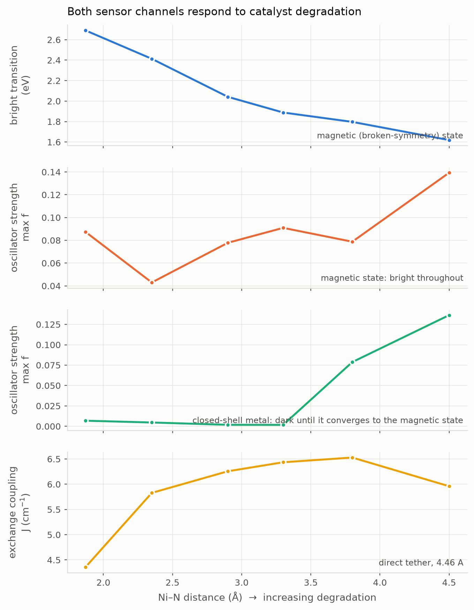

# NiMROD

**Ni**ckel **M**etal-organic **R**eporter **O**f **D**egradation.

Ab initio simulation of a spin-manifold **organic colour centre** used as a
nanosensor for the degradation of a metal-organic catalyst, built on
[Psi4](https://psicode.org) in the
[psi4numpy](https://github.com/FoleyLab/psi4numpy) idiom.

---

## The idea in one paragraph

Square-planar Ni(II) in a salen-type N₂O₂ pocket is d⁸ and closed-shell
(S = 0). When the catalyst starts to degrade, the first step is decoordination
of one imine arm: the ligand field weakens, and past some Ni–N separation the
**S = 1 state drops below S = 0** and the metal turns paramagnetic. To read that
out we attach an **organic colour centre** — a single aryl group covalently
bonded to a pyrene carbon, converting it to sp³. That one defect does two jobs
at once: it breaks the local π conjugation, creating a localised optical
transition, and it leaves an odd number of π electrons, creating an **unpaired
spin (S = 1/2)**. So the same defect reports through two independent channels —
an optical shift and a magnetic exchange coupling to the metal.

```
     pyrene host                phenylene tether        Ni(II) N2O2 catalyst
   ┌──────────────┐                                    ┌──────────────────┐
   │   ●─●─●─●    │                                    │      O     N     │
   │  ╱ ╲ ╱ ╲ ╱   │──── C6H4 ────────────────────────  │       ╲   ╱      │
   │ ●   C*  ●    │                                    │        Ni        │
   │  ╲ ╱│╲ ╱     │                                    │       ╱   ╲      │
   │   ●─┼─●      │                                    │      N     O     │
   └─────┼────────┘                                    └────────┼─────────┘
        aryl                                              labile arm, elongates
     sp3 defect                                            1.87 → 4.5 Å
   S = 1/2 + colour centre                            S = 0 → S = 1 on ligand loss
```

Full physical reasoning, method choices and limitations: **[docs/THEORY.md](docs/THEORY.md)**.

---

## Model system

| Object | Formula | Atoms | State |
|---|---|---|---|
| Host PAH | C₁₆H₁₀ (pyrene) | 26 | closed shell |
| Colour centre | C₂₂H₁₅ | 37 | **doublet** — sp³ aryl defect |
| Catalyst | C₆H₈N₂NiO₂ | 19 | singlet — square-planar d⁸ |
| Assembly | C₂₈H₂₁N₂NiO₂ | 54 | doublet |

The catalyst is a deliberately truncated salen analogue,
bis(iminoenolato)nickel(II). It keeps the electronic core that matters — a d⁸
metal in a square-planar N₂O₂ field — while being small enough for CASSCF, and
unlike real salen its chelate arms can dissociate completely, which a clean
ligand-loss coordinate requires.

PAHs are generated on an ideal graphene honeycomb lattice, so the builder is
checkable against known chemistry rather than against its own previous output;
the test suite asserts the molecular formulas of six PAHs, the sp³ character of
the defect carbon, and the *trans* donor geometry and bite angle of the complex.

---

## Results

### The spin manifold does flip

The load-bearing question was whether there is anything for a spin sensor to
detect. There is. As the imine arm swings open, the metal's S = 1 − S = 0 gap
collapses from ~+19 kcal/mol and three of four functionals cross into an S = 1
ground state.


| Ni–N (Å) | 1.87 | 2.35 | 2.90 | 3.30 | 3.80 | 4.50 |
|---|---|---|---|---|---|---|
| BP86 | +26.75 | +16.14 | +9.73 | +7.49 | +7.70 | +10.95 |
| B3LYP | +19.06 | +7.24 | +1.13 | −0.81 | −1.01 | +3.26 |
| PBE0 | +14.60 | +2.36 | −3.35 | −4.96 | −4.95 | −1.04 |
| ωB97X-D | +17.04 | +4.88 | −1.05 | −2.73 | −2.84 | +0.08 |
| **mean** | **+19.36** | **+7.66** | **+1.61** | **−0.25** | **−0.27** | **+3.31** |

Crossings: PBE0 at 2.53 Å, ωB97X-D at 2.78 Å, B3LYP at 3.13 Å. BP86 never
crosses — expected for a pure GGA with no exact exchange, which over-stabilises
low spin. **The crossing is real; its position is uncertain to roughly half an
ångström**, and that spread is the honest error bar.

The gap turning back up beyond ~3.8 Å is a feature of the rigid coordinate, not
of the chemistry: once the arm is fully detached the frozen remainder can no
longer reorganise into the three-coordinate geometry that stabilises S = 1.

### The colour centre is spin-localised, and feels the metal

On the A100, the full 54-atom assembly (584 basis functions) converges in 64
seconds. At the intact geometry the unpaired electron is **entirely** on the
colour centre — Mulliken spin 4×10⁻⁵ on nickel against 0.28–0.30 on the pyrene
carbons, 0.9995 of the total on the defect fragment. That is the sensor at rest:
closed-shell metal, S = 1/2 defect, no coupling.

By Ni–N = 4.50 Å the metal carries 0.064 and ⟨S²⟩ has risen from 0.814 to
**1.332**, far above the 0.75 of a clean doublet. That growth in quartet
character is the magnetic readout — the doublet is being forced to accommodate a
metal that has gone paramagnetic.

### Validation

22 of 24 benchmark gaps converge, none with the ground-state ordering wrong and
every triplet reference within 0.05 of ⟨S²⟩ = 2. Mean absolute error against the
single-determinant reference: **M06 2.77**, B3LYP 4.56, ωB97X-D 4.84, BP86 5.45,
PBE 6.94, TPSS 8.81, TPSSh 9.12, PBE0 9.16 kcal/mol.

Note that TPSSh — the conventional recommendation for 3d spin-state energetics,
and this project's original `REFERENCE_FUNCTIONAL` — comes out second worst. The
scan geometries use B3LYP on the strength of the measurement rather than the
reputation.

### The magnetic readout works, and says the design is too weakly coupled

Building the broken-symmetry determinant deliberately — converge the quartet,
flip the alpha/beta density on the colour-centre fragment, re-converge at
Ms = ½ — finds the state the default guess never did:

| Ni–N (Å) | Ni spin (HS) | Ni spin (BS) | defect spin (BS) | ⟨S²⟩ HS / BS | *J* (cm⁻¹) | meaningful |
|---|---|---|---|---|---|---|
| 1.87 | +0.12 | −0.00 | +1.00 | 3.81 / 0.80 | −7052 | **no** |
| 2.35 | +1.63 | +1.63 | −1.00 | 3.81 / 1.81 | +0.4 | yes |
| 2.90 | +1.62 | +1.62 | −1.00 | 3.81 / 1.81 | +0.4 | yes |
| 3.30 | +1.62 | +1.62 | −1.00 | 3.81 / 1.81 | +0.4 | yes |
| 3.80 | +1.62 | +1.62 | −1.00 | 3.81 / 1.81 | +0.4 | yes |
| 4.50 | +1.58 | +1.58 | −1.00 | 3.81 / 1.81 | +0.4 | yes |

Past 2.35 Å the metal carries ~1.6 spin, the defect −1.0, the two fragments are
antiparallel, and ⟨S²⟩_BS ≈ 1.81 against the 1.75 expected for S = 1 coupled to
S = ½. That is a textbook broken-symmetry pair.

At the intact geometry the flip **relaxes straight back** to a closed-shell
metal (Ni spin 0.00), so no exchange pathway exists and the guard marks the
−7052 cm⁻¹ as not meaningful. That number was the artefact reported by the
previous pass; it is now rejected automatically rather than by hand.

**The result is a negative one for this design.** *J* ≈ +0.4 cm⁻¹ wherever it is
defined — the quartet and broken-symmetry doublet are degenerate to within
4 microhartree. The defect spin sits 8.75 Å from the metal behind a 1,4-phenylene
and an sp³ carbon, and that saturated centre is exactly what breaks conjugation
to make the colour centre in the first place. The same feature that creates the
optical defect insulates it magnetically. **A 0.4 cm⁻¹ splitting is far below
what EPR could resolve against room-temperature linewidths**, so the magnetic
channel of *this* geometry is not a usable sensor. Shortening the tether, or
replacing the phenylene with a conjugated bridge, is the obvious next variable —
the machinery to test it is now in place.

### Shortening the tether recovers the coupling ~15-fold

Removing the phenylene and bonding the catalyst straight onto the defect carbon
cuts the metal–defect separation from 8.75 Å to 4.46 Å while **keeping** the sp³
centre, which isolates distance from conjugation as the variable:

| Ni–N (Å) | *J* phenylene (8.75 Å) | *J* direct (4.46 Å) |
|---|---|---|
| 1.87 | not meaningful | +4.4 |
| 2.35 | +0.4 | +5.8 |
| 2.90 | +0.4 | +6.3 |
| 3.30 | +0.4 | +6.4 |
| 3.80 | +0.4 | +6.5 |
| 4.50 | +0.4 | +5.8 |

So the sp³ carbon **attenuates** the coupling rather than killing it — distance
dominates, and halving it buys about an order of magnitude. Roughly 6 cm⁻¹ is
still weak, but unlike 0.4 cm⁻¹ it is within reach of low-temperature
magnetometry or variable-temperature EPR.

**But *J* barely varies along the coordinate**, so it is not a graded readout.
What changes with degradation is not the size of the coupling but whether the
magnetic state is *populated at all* — and that is what the bare-catalyst scan
answers, with S = 1 crossing below S = 0 at 2.5–3.1 Å. The sensor this design
supports is therefore a **threshold detector**, not a ruler: silent while the
metal is closed-shell, reporting ~6 cm⁻¹ once degradation has passed the
crossing.

One caveat the guard does not catch. It verifies that the broken-symmetry
determinant has a magnetic metal and antiparallel fragments, which is why *J* is
flagged meaningful at 1.87 Å in the direct variant (Ni spin 1.59). But at that
geometry the magnetic state is ~19 kcal/mol *above* the closed-shell ground
state, so that number describes coupling inside an excited manifold. **A
converged, correctly-constructed broken-symmetry pair can still be describing a
state the molecule never occupies** — the guard checks the determinant, not its
thermal accessibility.

### The optical readout works — once both determinants are treated consistently

Computing TD-DFT on **both** doublet solutions at **every** geometry (rather than
on whichever one happened to be lower) gives two internally consistent series,
and the picture changes completely:



| Ni–N (Å) | bright state, magnetic | max *f* magnetic | max *f* closed-shell |
|---|---|---|---|
| 1.87 | 2.691 eV / 461 nm | 0.0875 | 0.0068 |
| 2.35 | 2.413 eV / 514 nm | 0.0430 | 0.0046 |
| 2.90 | 2.041 eV / 607 nm | 0.0778 | 0.0018 |
| 3.30 | 1.888 eV / 657 nm | 0.0909 | 0.0017 |
| 3.80 | 1.797 eV / 690 nm | 0.0788 | 0.0788 |
| 4.50 | 1.619 eV / 766 nm | 0.1393 | 0.1363 |

Two distinct signals, not one:

**A monotonic red shift.** On the magnetic state the bright transition moves
461 → 766 nm across the coordinate — **1.07 eV**, the whole visible range. This
is the graded readout the design was after, and the earlier claim that bright
states existed at only two geometries was purely the reference switching.

**An intensity switch.** While the metal is closed-shell the defect is
essentially dark (*f* = 0.002–0.007); on the magnetic state it is bright
(*f* = 0.04–0.14), a factor of ~20. At 3.80 and 4.50 Å the two columns converge
to the same numbers because the "closed-shell" SCF now finds the magnetic
solution too — independent confirmation that the magnetic state has become the
ground state, consistent with the bare-catalyst crossing at 2.5–3.1 Å.

Restricting to where the magnetic state is actually populated (≳2.9 Å), the
observable shift is 607 → 766 nm, 0.42 eV. Still large, and now measurable
alongside a *J* that switches on at the same threshold: **two independent
channels reporting the same event**, which is what distinguishes a sensor
reading from solvatochromism or a temperature drift.

### Earlier: the optical readout looked partial

With oscillator strengths computed directly from the TDA amplitudes and dipole
integrals (both of gpu4pyscf's own routines raise on this system), bright
transitions do appear — 1.868 eV / 664 nm (*f* = 0.117) at Ni–N = 3.30 Å and
1.781 eV / 696 nm (*f* = 0.100) at 3.80 Å. Those are the two geometries where
the broken-symmetry determinant is the ground state. At the other distances the
lowest twelve roots of the closed-shell-metal doublet are all dark
(*f* < 0.01), so there is no continuous band to track across the coordinate and
**no demonstrated optical sensing curve** — only evidence that the defect does
carry oscillator strength in the red once the metal is magnetic.

### Earlier: why the first coupled attempt failed

With the assembly properly relaxed on the GPU (387 s for the 54-atom radical),
the doublet SCF puts the unpaired electron entirely on the colour centre at
**every** point on the coordinate — spin on nickel stays at ~10⁻⁴ out to
Ni–N = 4.50 Å, and ⟨S²⟩ sits at 0.803 rather than climbing.

That directly contradicts the bare-catalyst scan, which says the metal should be
S = 1 past ~2.5–3.1 Å. Both cannot be right, and the bare-catalyst result is the
better-supported one: it is four functionals agreeing on a monotonic trend.

The resolution is that a doublet assembly has **two** distinct SCF solutions — a
closed-shell metal with the spin on the defect, and an S = 1 metal
antiferromagnetically coupled to the defect. They have the same Ms. The default
guess converges to the first one at every geometry, so no exchange pathway is
ever sampled. This is the same "converged but not the ground state" failure that
produced the 85 kcal/mol ωB97X-D artefact earlier, wearing different clothes.

The Yamaguchi values in `data/results/assembly_readout.jsonl` (−7052 to
+62 cm⁻¹) are therefore **meaningless as exchange couplings**: with a
closed-shell metal there is no second spin centre, so the quartet is a promoted
excited configuration and J is measuring promotion energy. The −7052 cm⁻¹ at the
*intact* geometry, where the metal is unambiguously S = 0, is the tell.

Fixing it means constructing the broken-symmetry determinant deliberately —
converge the quartet, flip the spin on the metal fragment, and re-converge —
rather than hoping the SCF finds it. The machinery for that exists in
`nimrod/spin.py`; it has not been wired into the GPU path.

### What is *not* established

- **No optical readout yet.** TD-DFT ran on the assembly but on the unrelaxed
  builder geometry, and returned implausibly low excitation energies
  (0.09–2.0 eV) with oscillator strengths that failed to compute. Those numbers
  are in `data/results/assembly_gpu.jsonl` for provenance and **should not be
  quoted**. The optical channel needs a relaxed geometry first.
- **No exchange coupling J yet.** The broken-symmetry machinery is implemented
  and unit-tested but has not been run on the assembly.
- The scan is rigid, so crossing distances carry a systematic error, and there
  are no barriers or dissociation energies here.

## Install

Psi4 is not on PyPI — it ships through conda-forge. `setup.sh` fetches a
standalone micromamba (no root, no pre-existing conda) and builds the
environment:

```bash
./setup.sh
export MAMBA_ROOT_PREFIX="$PWD/.mamba"
./bin/micromamba run -n nimrod python -m nimrod.cli info
```

## Use

```bash
nimrod info                  # describe the model system
nimrod xyz sensor -o s.xyz   # dump a structure for viewing
nimrod validate              # spin-state validation against experiment
nimrod scan                  # catalyst degradation scan
nimrod occ                   # colour-centre photophysics
nimrod figures               # rebuild figures from stored results
```

Every calculation is cached in `data/cache/`, keyed by a hash of the full job
specification, so an interrupted run resumes instead of restarting.

---

## What is actually in here

```
nimrod/
  config.py       compute budget, basis + functional registries, SCF preset ladder
  psi4_driver.py  defensive Psi4 wrapper: option hygiene, SCF fallbacks, caching
  geometry.py     honeycomb PAH builder, sp3 defect, Ni complex, assembly, scan geometries
  spin.py         <S^2> from AO overlap, spin populations, broken symmetry, Yamaguchi J
  excited.py      TD-DFT and EOM-CCSD, colour-centre absorption and shift
  casscf.py       CASSCF spin manifolds and multireference diagnostics
  sapt.py         SAPT0 decomposition of solvent capture at the vacated site
  degradation.py  relaxed ligand-loss scan with sequential continuation
  validation.py   benchmark tier against experimental singlet-triplet gaps
  plots.py        figures, CVD-validated palette, light and dark
gpu/              GPU offload of large TD-DFT via GPU4PySCF and the Colab CLI
```

### Three engineering details that matter

**Option hygiene.** Psi4 options are global and persist between calls. A stale
`tdscf_states` makes the *next* job fail with an irrep-count mismatch. Every job
runs inside a context that resets global state first.

**Scratch.** `detci` aborts the whole process with `PSIO_ERROR 18` if
`PSI_SCRATCH` points at a shared or full `/tmp`. It is pinned to a project-local
directory.

**SCF convergence.** Open-shell 3d-metal SCF routinely fails from the default
guess, so the driver walks a ladder of presets (SAD → SOSCF → damped core →
GWH with heavy damping) until one converges, and records which one did, so the
provenance ends up in the results.

---

## Honesty about scope

- **Gas phase, 0 K, no zero-point or thermal corrections.** Real ligand
  dissociation is strongly solvent-assisted.
- **The scan is a coordinate, not a mechanism.** Freezing Ni–N and relaxing the
  rest gives no transition state and no barrier.
- **Spin-state DFT is functional-sensitive.** Nothing is reported from a single
  functional; the spread across a ladder spanning 0–27% exact exchange is the
  uncertainty. Where functionals disagree on the *sign* of a gap, that is stated
  rather than averaged away.
- **The models are analogues.** A truncated catalyst and a molecular
  colour-centre host reproduce mechanism and rough magnitude, not the numbers of
  any specific real material. Genuine organic colour centres live on carbon
  nanotubes, which a molecular code cannot treat.

---

## GPU offload

Psi4 is CPU-only; GPUs do not accelerate it. The large TD-DFT on the 54-atom
assembly is instead offloaded to **GPU4PySCF** on a Colab GPU runtime driven by
the [Google Colab CLI](https://github.com/googlecolab/google-colab-cli). That
path needs a one-time Google authentication on the operator's own machine and is
**not exercised** by the automated runs here. See **[gpu/README.md](gpu/README.md)**.

---

## Credits

Method patterns follow [psi4numpy](https://github.com/FoleyLab/psi4numpy)
(Foley Lab fork). Psi4 is BSD-3-Clause; this project is MIT.

### Pentacene on real Ni(salen): the host matters, and it hurts

Attaching pentacene at C3 of Ni(salen) puts the defect 4.62 Å from the metal —
essentially the same separation as the 4.46 Å pyrene construct that recovered
the coupling — which makes it close to a controlled test of the *host* at fixed
distance.

| Ni–N (Å) | Ni spin (HS) | Ni spin (BS) | defect (BS) | ⟨S²⟩ HS / BS | *J* (cm⁻¹) | max *f* | bright |
|---|---|---|---|---|---|---|---|
| 2.90 | +1.22 | +1.22 | −0.98 | 3.85 / 1.84 | −1.1 | 0.359 | 0.994 eV / 1248 nm |
| 4.50 | +1.04 | +1.04 | −0.96 | 3.94 / 1.91 | −1.1 | 0.217 | 0.594 eV / 2086 nm |

**Magnetically, pentacene is worse than pyrene.** *J* = −1.1 cm⁻¹ against pyrene's
+6 cm⁻¹ at effectively the same distance — five times smaller and opposite in
sign. So distance is *not* the whole story, but the host effect runs the wrong
way. The mechanism is visible in the spin populations: the metal carries only
+1.04 to +1.22 rather than pyrene's +1.6, so pentacene's larger, more
polarisable π system is bleeding spin density away from the metal instead of
strengthening the exchange pathway. ⟨S²⟩ on the broken-symmetry doublet also
reaches 1.84–1.91 against the 1.75 ideal, worse contamination than pyrene's
1.81, which is the multireference character showing up exactly where it was
expected.

**Optically it is much stronger.** Oscillator strengths of 0.22–0.36 against
pyrene's 0.04–0.14, with the bright transition deep in the near-IR and
red-shifting on degradation (1248 → 2086 nm). But the *contrast* that made the
pyrene result attractive is gone: the broken-symmetry and closed-shell
determinants give the same oscillator strength to four decimals here, so there
is no dark/bright switch, only a shift.

Two caveats that matter for how far to trust this:

- **The geometry is only partially relaxed.** Three Colab sessions died inside
  the full 70-atom optimisation, so this run capped it at 15 steps. That is
  enough to relieve builder strain, not to reach a minimum, and the very low
  excitation energies (0.594 eV) are the kind of thing an unconverged geometry
  produces. Treat the optical numbers as indicative.
- **Ni–N = 1.85 Å was rejected, correctly.** The ethylenediamine torsions only
  span 1.87–5.31 Å, so the opener raised rather than forcing an impossible
  geometry — the intact reference point is missing from this table for a real
  structural reason, not a numerical one.

### Scaling to a real catalyst: the magnetic channel gains, the optical one does not

Pyrene on real Ni(salen) at C3, same host and protocol as the truncated-model
study, opening the arm *opposite* the defect:

| Ni–N (Å) | Ni spin (BS) | defect (BS) | ⟨S²⟩ HS / BS | *J* (cm⁻¹) | *f* (BS) | *f* (closed-shell) |
|---|---|---|---|---|---|---|
| 2.90 | +1.18 | −0.94 | 3.86 / 1.83 | −23.0 | 0.237 | 0.237 |
| 3.60 | +1.13 | −0.89 | 3.86 / 1.78 | −50.9 | 0.171 | 0.167 |
| 4.50 | +0.98 | −0.91 | 3.94 / 1.88 | −22.7 | 0.169 | 0.127 |

**The coupling is 4–8× stronger than on the truncated model** (+6 cm⁻¹ there) and
opposite in sign. 23–51 cm⁻¹ is 33–73 K, which moves the magnetic channel from
a specialist cryostat measurement toward routine variable-temperature EPR. The
truncated model was *understating* what the real complex does — the conjugated
salicylidene ring between defect and metal is a better exchange pathway than the
aliphatic backbone it replaced, and the sign change says a different orbital
pathway now dominates rather than the same one being stronger.

**But *J* is not monotonic.** It peaks at 3.60 Å and falls off on both sides, so
it is a signature rather than a ruler — you could tell "partially degraded" from
"intact" or "fully dissociated", but not read extent off the magnitude.

**The optical on/off contrast is largely gone.** At 2.90 and 3.60 Å the
broken-symmetry and closed-shell determinants give the same oscillator strength
to three decimals; only at 4.50 Å is there a ~33% difference, against the ~20×
seen on the truncated model. The intensity switch was the more robust of the two
optical signals, and it does not survive the move to a real catalyst.

**The computed transition energies here should not be quoted.** Bright states
(*f* ≈ 0.2) at 0.20–0.34 eV are not physically credible for this chromophore —
d–d transitions in that range carry oscillator strengths orders of magnitude
smaller. The geometry was relaxed for only 15 steps because longer optimisations
outlived the Colab session, and implausibly low excitations with large intensity
are a known signature of an unconverged geometry combined with a
broken-symmetry reference. The *J* values rest on total energies and are far
less sensitive to this; the excitation energies need a converged structure
before they mean anything.

**The pentacene comparison is not like-for-like.** That run opened `N1`, the arm
*carrying* the reporter, rather than the arm opposite it — a different
degradation mode. Its numbers stand as recorded but should not be set against
this series.

### The observer effect is 0.2% of the signal

The objection to a covalently tethered probe is that it changes the chemistry it
is watching. The useful test is not whether the perturbation is "minor" but
whether it is small compared with the difference being resolved.

At the intact geometry, with the colour centre deleted and the attachment carbon
re-hydrogenated so the catalyst coordinates are identical either way:

| | metal S=0 → S=1 gap |
|---|---|
| bare Ni(salen) | +20.07 kcal/mol |
| pyrene-tethered | +20.02 kcal/mol |
| **shift** | **−0.045 kcal/mol, 0.23% of the gap** |

Both sides computed in PySCF 2.14.0; see the cross-code note below for the
independent Psi4 and gpu4pyscf numbers, which agree to 0.0008 kcal/mol.

The tether is electronically almost invisible to the metal. A probe reading a
~20 kcal/mol spin-state change perturbs that change by four hundredths of a
kcal/mol, so the readout reports the catalyst rather than its own influence.

Getting this number required constructing the closed-shell-metal doublet
deliberately, by quenching the metal's spin in the converged quartet — the
mirror of the broken-symmetry construction. It is the only one of the three
accessible doublets that corresponds to a diamagnetic metal, and neither the
broken-symmetry state nor the default guess is it. Assuming otherwise produced
an earlier, retracted claim of a 142% perturbation that was entirely an
artefact of differencing two unlike quantities.

Three limits on the claim:

- **Electronic only.** Matched geometries isolate the electronic perturbation.
  Whether the tether shifts the catalyst's *equilibrium structure* is a separate
  question needing a relaxed-versus-relaxed comparison.
- ~~**Cross-code.**~~ **Resolved — both sides recomputed in one code.** The bare
  number was Psi4 and the tethered one gpu4pyscf, so −0.044 kcal/mol contained
  both the perturbation and any disagreement between two implementations, and
  the two could have partly cancelled. Running both sides in PySCF 2.14.0 — the
  version gpu4pyscf 1.8.1 is built on, so the same code path on a different
  device — at the identical geometry:

  | | PySCF | reference | difference |
  |---|---|---|---|
  | bare Ni(salen) | +20.0699 | Psi4 +20.0691 | +0.0008 |
  | pyrene-tethered | +20.0246 | gpu4pyscf +20.0246 | −0.00002 |
  | **shift** | **−0.0453 (0.23%)** | cross-code −0.0445 (0.22%) | 0.0008 |

  The two programs differ by 0.0008 kcal/mol on the bare gap — 2% of the shift
  being measured, 0.004% of the signal. CPU PySCF and an A100 reproduce the
  tethered gap to 2×10⁻⁵ kcal/mol. **The observer effect is the perturbation,
  not an artefact of comparing two codes**, and the same-code figure (0.23%)
  lands on the cross-code one (0.22%) rather than replacing it.
- **Intact geometry only.** The closed-shell metal exists as an SCF solution
  only there; once the arm opens the bare catalyst is 18.6–23.8 kcal/mol
  high-spin and the state has nothing to converge to. That is the right place to
  measure anyway, since it is the reference the sensor reads against.
